# CMPE 172 - Lab #10 Notes

## CI Workflow Part 1

Below screenshot shows where we get workflow templates from

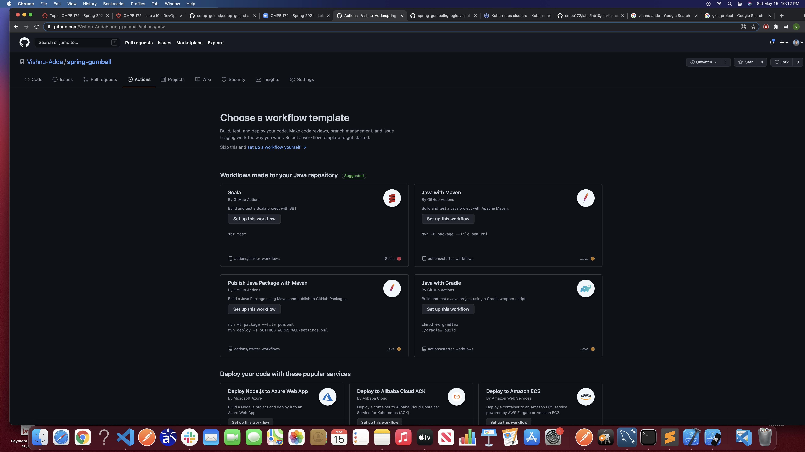

Below screenshot shows the success for the first workflow (build).

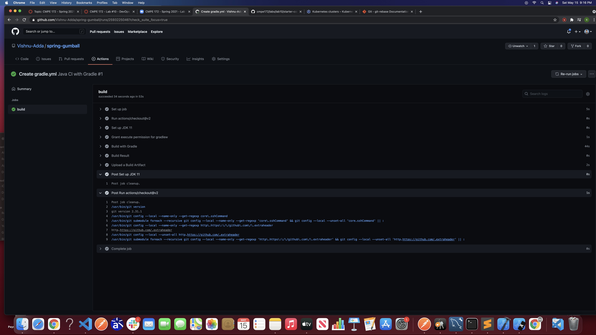

## CI Workflow Part 2

See below for Service Accounts.

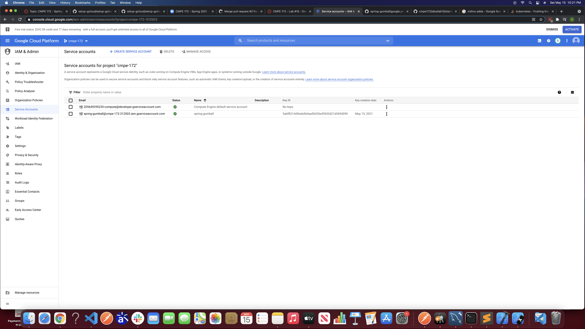

Below image shows a key for the service account.

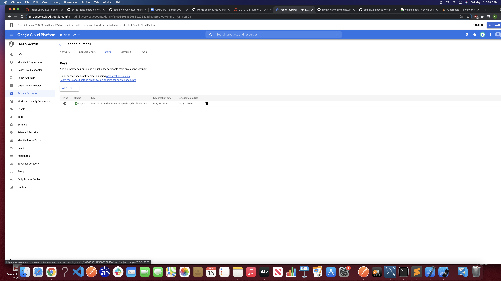

Below image shows Action Secrets on GitHub.

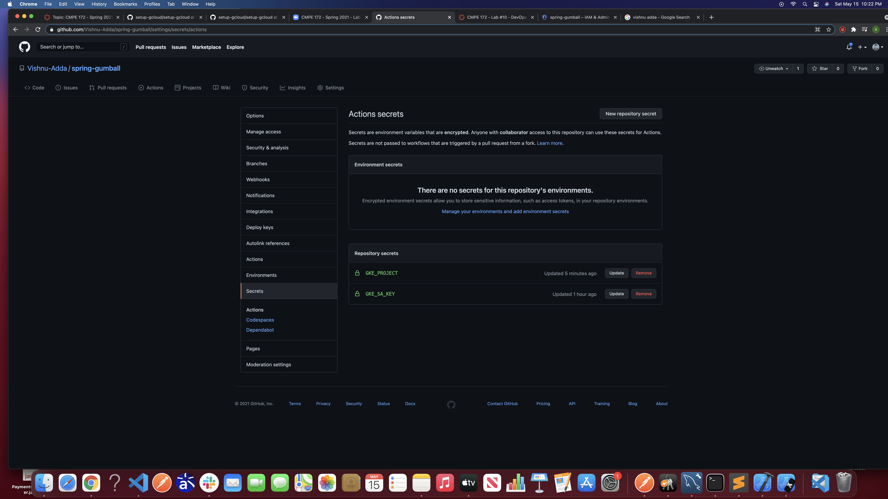

Below image shows the cluster on GKE.

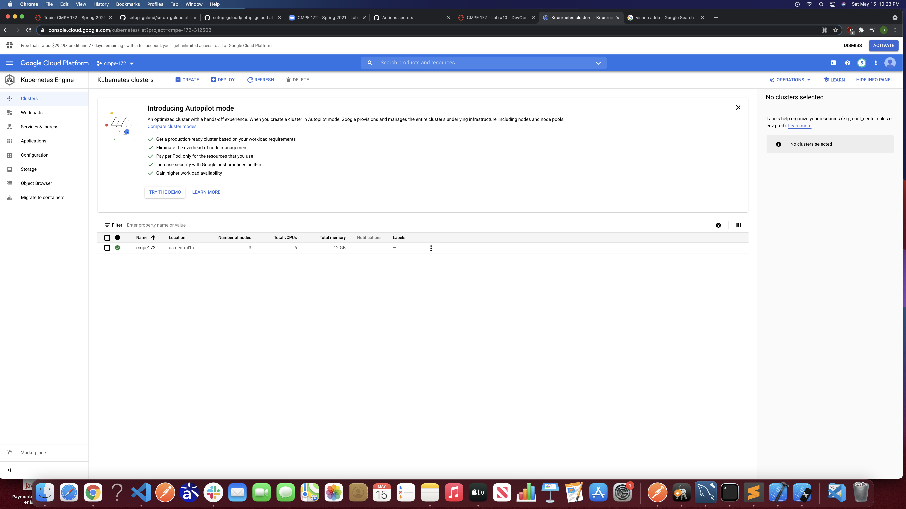

Below image shows the releases I created.

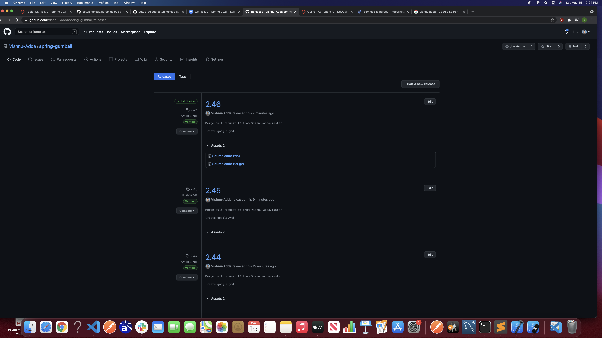

Below image shows all the workflows seen on GitHub.

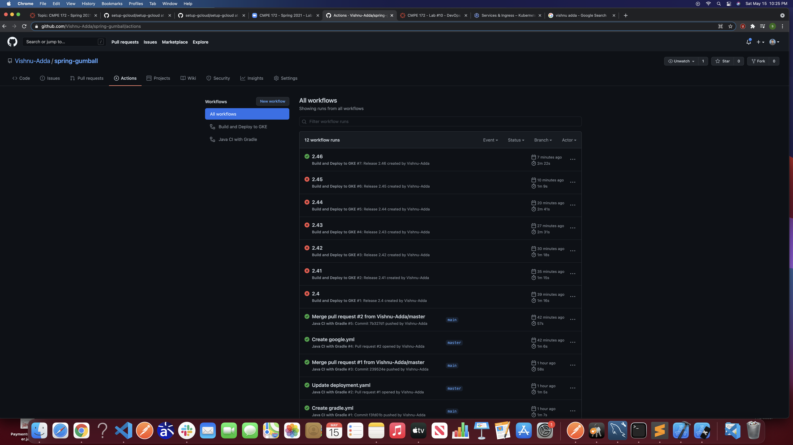

Below image shows the details on the successful release for GKE deployment.

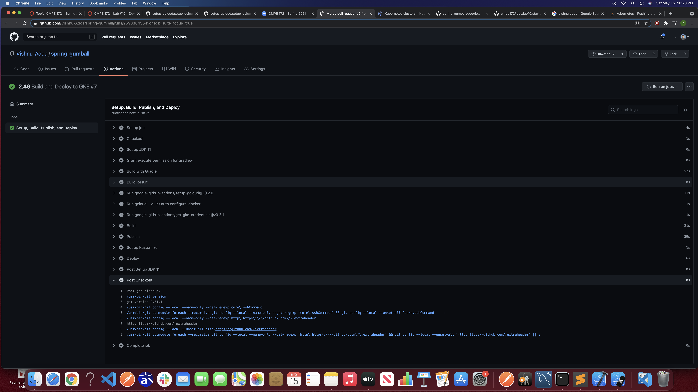

Below image shows the workload (pods) on GKE.

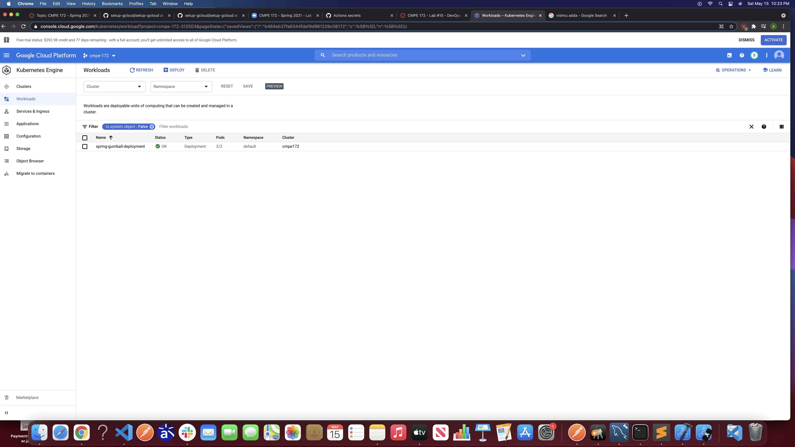

Below image shows the service on GKE.

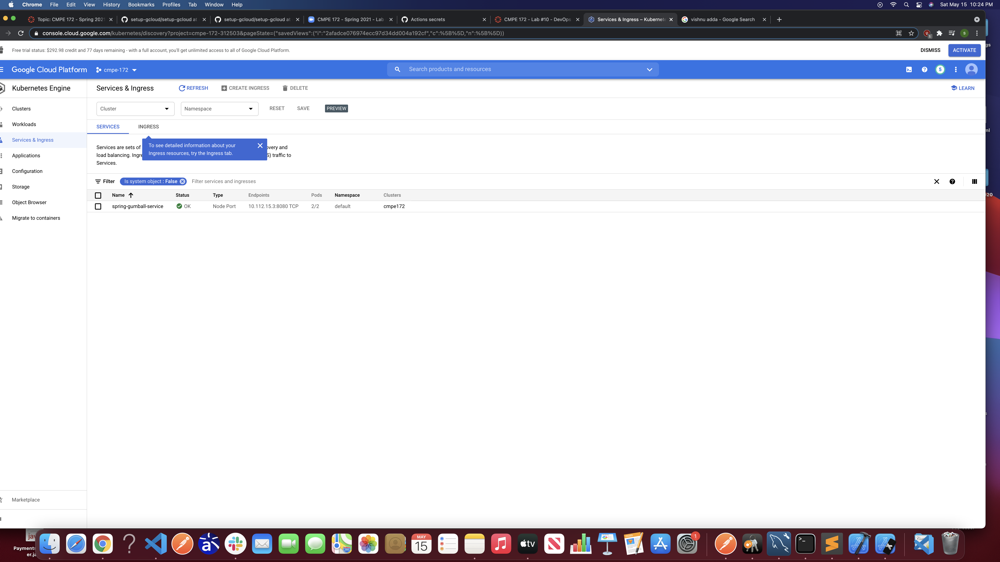

Below image shows the process of creating the ingress.

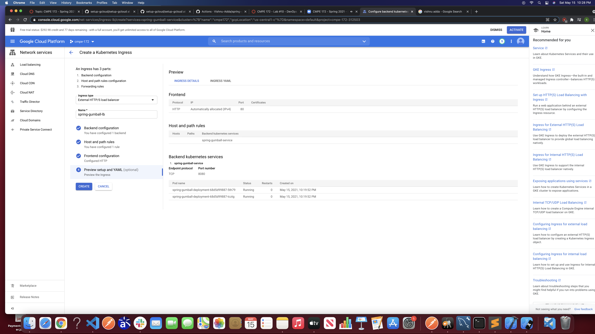

Below image shows the completely created ingress on GKE.

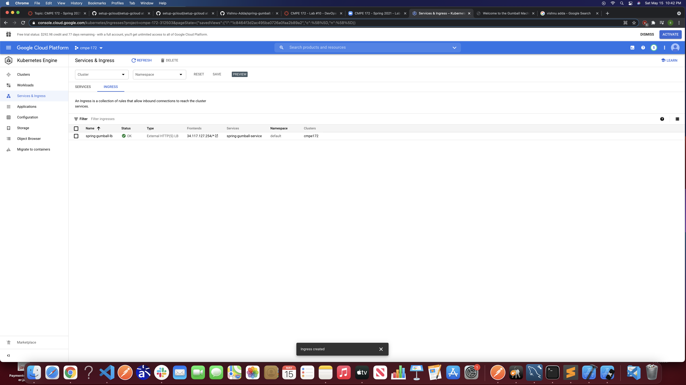

The below image shows the gumball webpage being served by GKE.

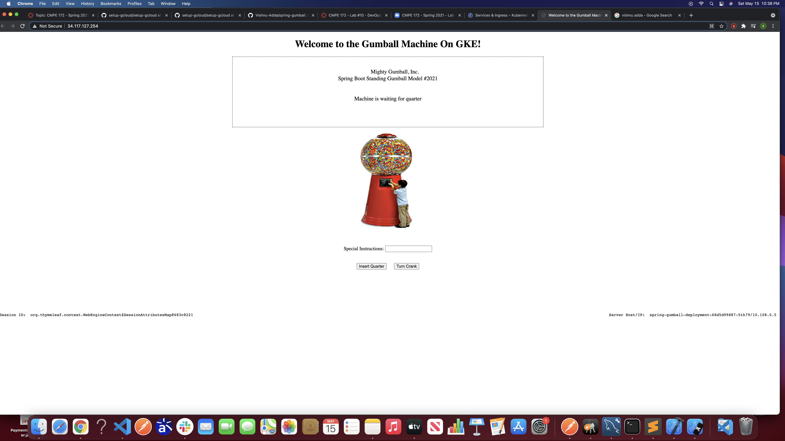

The main challenge I faced was trying to create the secret keys on GitHub. I mostly wasn't sure about what to put for GKE_PROJECT but after looking online, I found out that I needed to put the project ID and not the project name.